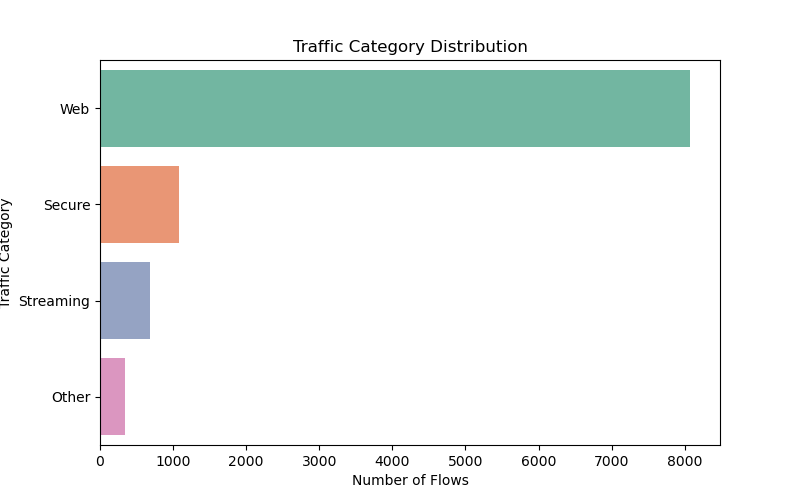
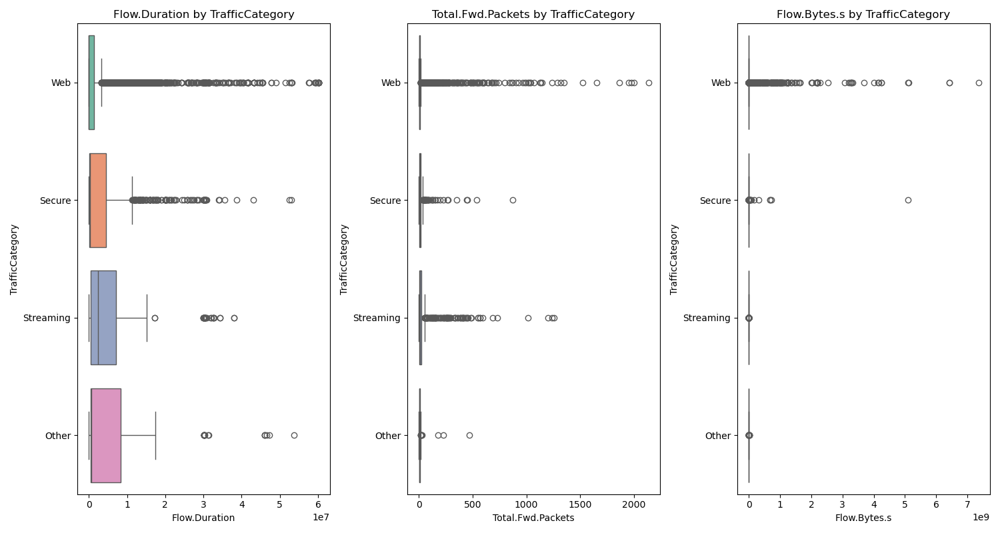
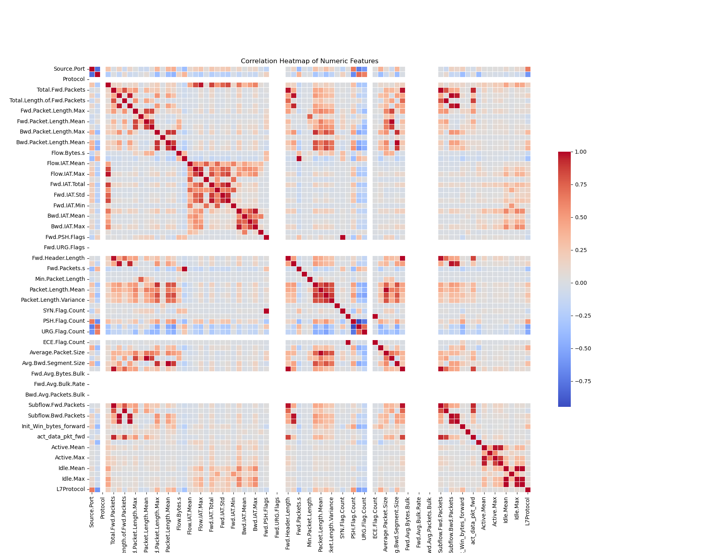
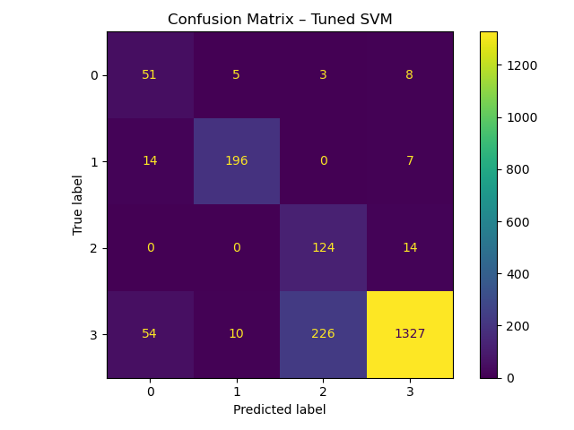

# ML-Based Network Traffic Classifier

This project aims to classify real-time network traffic using machine learning, based on flow-level features extracted from IP packet streams. Instead of relying on deep packet inspection (DPI), we leverage metadata to identify the application type (e.g., Web, Streaming, Secure) — even when traffic is encrypted.

## Project Goals

- Perform Exploratory Data Analysis (EDA) on flow-level network data
- Map fine-grained protocols into meaningful traffic categories
- Train and compare SVM and Neural Network classifiers
- Evaluate accuracy and suitability for real-time classification
- Highlight patterns in encrypted vs. unencrypted traffic

## Dataset

This project uses the **IP Network Traffic Flows Labeled with 87 Apps** dataset from Kaggle:

📎 [Kaggle Dataset – IP Network Traffic Flows](https://www.kaggle.com/datasets/jsrojas/ip-network-traffic-flows-labeled-with-87-apps)

### How to Use:
1. Download the dataset manually from the Kaggle link above (login required).
2. Extract the archive and locate the file:  
   `Dataset-Unicauca-Version2-87Atts.csv`
3. Move it into the project’s `data/` directory:
   ```bash
   mkdir -p data
   mv Dataset-Unicauca-Version2-87Atts.csv data/

### NOTE: The CSV file is ~1.7GB. It is not included in the GitHub repo due to size limitations.

# ML-Based Network Traffic Classifier

This project builds and evaluates machine learning models to classify IP network traffic into application-level categories using only flow-level metadata — without inspecting payload content. Even when traffic is encrypted, we aim to infer whether flows belong to applications like Web, Streaming, Secure, DNS, or Others, enabling real-time classification, traffic shaping, and threat detection.

## Project Goals

- Perform detailed exploratory data analysis (EDA) on flow-level features
- Group low-level protocols into meaningful traffic categories
- Handle multi-class imbalance with techniques like SMOTE
- Train and compare SVM and Neural Network classifiers
- Evaluate each model’s suitability for near real-time classification

## Dataset

This project uses the **IP Network Traffic Flows Labeled with 87 Apps** dataset available on Kaggle.

**Source:**  
https://www.kaggle.com/datasets/jsrojas/ip-network-traffic-flows-labeled-with-87-apps

- File: `Dataset-Unicauca-Version2-87Atts.csv` (~1.7 GB)
- 3.5M rows × 87 features
- Includes timestamp, size, direction, header stats, and `ProtocolName` labels

### How to Use This Dataset:

1. Go to the Kaggle link above and download the dataset (requires login)
2. Unzip the archive and locate:
   ```
   Dataset-Unicauca-Version2-87Atts.csv
   ```
3. Place the file inside the `data/` directory of this project:
   ```bash
   mkdir -p data
   mv Dataset-Unicauca-Version2-87Atts.csv data/
   ```

> **Note:** The full dataset is **not included in this repo** due to size limitations.

## Exploratory Data Analysis (EDA)

We performed extensive data profiling and statistical exploration to prepare for modeling.

**Key steps:**
- Removed low-variance and ID-like columns
- Mapped 87 unique `ProtocolName` values into 5 meaningful categories:
  - Web, Secure, Streaming, DNS, Other
- Checked for imbalance and missing values
- Visualized distributions, outliers, and feature correlations

### Visual Highlights

**Traffic Category Distribution**  


**Boxplots by Category**  


**Correlation Heatmap**  


## Modeling Approach

We framed this as a multi-class classification task and compared multiple approaches:

| Step                 | Methodology                                   |
|----------------------|-----------------------------------------------|
| Preprocessing        | StandardScaler on numerical features          |
| Class Imbalance      | SMOTE (oversampling minority traffic types)   |
| Models Evaluated     | SVM (base, with SMOTE, tuned) + MLP (v1 & v2) |
| Evaluation Metrics   | Accuracy, Macro F1-Score, Confusion Matrix    |

## Model Performance Comparison

| Model               | Accuracy | Macro F1 | Summary |
|---------------------|----------|----------|---------|
| Base SVM            | ~0.85    | ~0.47    | High accuracy, poor recall on minority classes |
| SVM + SMOTE         | ~0.74    | ~0.61    | Better recall, reduced accuracy overall |
| Tuned SVM (RBF)     | **0.83**     | 0.72     | **Best overall balance of accuracy and fairness** |
| MLP v1 (baseline)   | 0.46     | 0.18     | Strong bias toward majority class |
| MLP v2 (tuned)      | 0.36     | 0.19     | Slight recall improvement, unstable accuracy |

**Confusion Matrix – Tuned SVM**  


## Final Recommendation

After evaluating both classical and deep learning models:

- The **tuned SVM (RBF kernel, C=10, gamma='scale')** provided the best balance of accuracy and fairness.
- Achieved **83% test accuracy** and **0.72 macro F1-score**
- Robust even with class imbalance
- Suitable for production and real-time inference

### Saved Models:

- `models/svm_tuned_model.pkl` — final SVM model
- `models/scaler.pkl` — fitted StandardScaler
- `models/mlp_model_v2.h5` — tuned MLP (underperforming but archived)


## How to Reproduce This Project

### 1. Clone the Repo

```bash
git clone https://github.com/your-username/ml-network-traffic-classifier.git
cd ml-network-traffic-classifier
```

### 2. (Optional) Create a Virtual Environment

```bash
conda create -n net-ml python=3.9
conda activate net-ml
```

### 3. Install Python Requirements

```bash
pip install -r requirements.txt
```

### 4. Run the Notebook

```bash
jupyter notebook network_traffic_analysis.ipynb
```

You can use `sample_network_data.xlsx` for testing, or follow the Dataset section above to enable full training with the original CSV.

## Real-Time Inference Tools
To support real-time classification, the trained SVM model is exposed through:

### 1. CLI Tool: inference.py
Run predictions on new flow data using the command line:

bash
python inference.py --file sample_input_from_x_test.csv

This will load the trained model and scaler, apply preprocessing, and print predicted class labels for each flow.

- Input file must match the training feature structure.
- Use sample_input_from_x_test.csv as a working example (25 real flow samples).

### 2. Web App: streamlit_app.py
Launch an interactive web interface to upload and classify CSV files:

bash
streamlit run streamlit_app.py
Then open: http://localhost:8501

Upload sample_input_from_x_test.csv

View predictions and a bar chart of predicted traffic categories

### Input Format
The model expects 81 flow-level features that match the original training data (e.g., Flow.Duration, Packet.Length.Mean, ACK.Flag.Count, etc.).

Use the provided file:
sample_input_from_x_test.csv
This was extracted from real test data and ensures valid results.

## Future Work

- Train MLP or CNN on full dataset using batch generators
- Package the tuned SVM into a REST API (FastAPI or Flask)
- Add SHAP/XAI-based explanation for model predictions
- Integrate with streaming tools (e.g., Kafka, Cloud Run) for real-time classification
- Extend classification granularity beyond top-level app categories

## License

MIT License

## Acknowledgments

- Dataset provided by Universidad del Cauca (Colombia)
- Kaggle community for open data contributions
- UC Berkeley Machine Learning program (2024–25) for project support and structure
- libraries used: pandas, numpy, matplotlib, seaborn, scikit-learn, imbalanced-learn, openpyxl, jupyterlab, tensorflow, keras, joblib, fastapi, uvicorn
# ML-network-traffic-classifier-model

